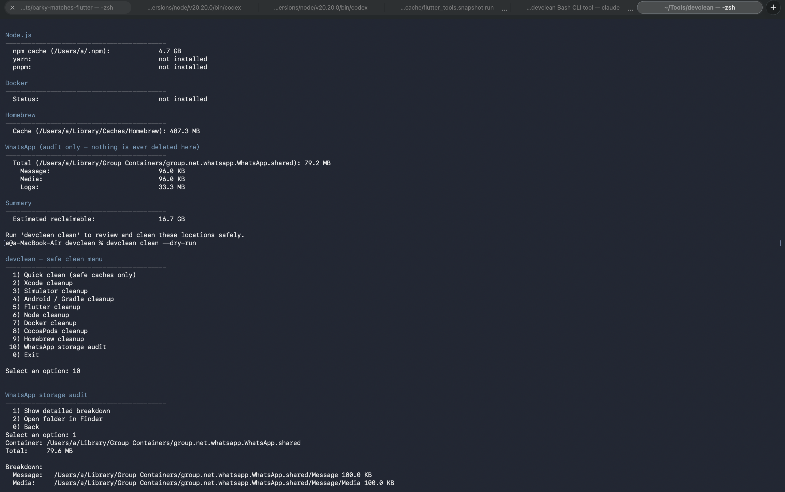
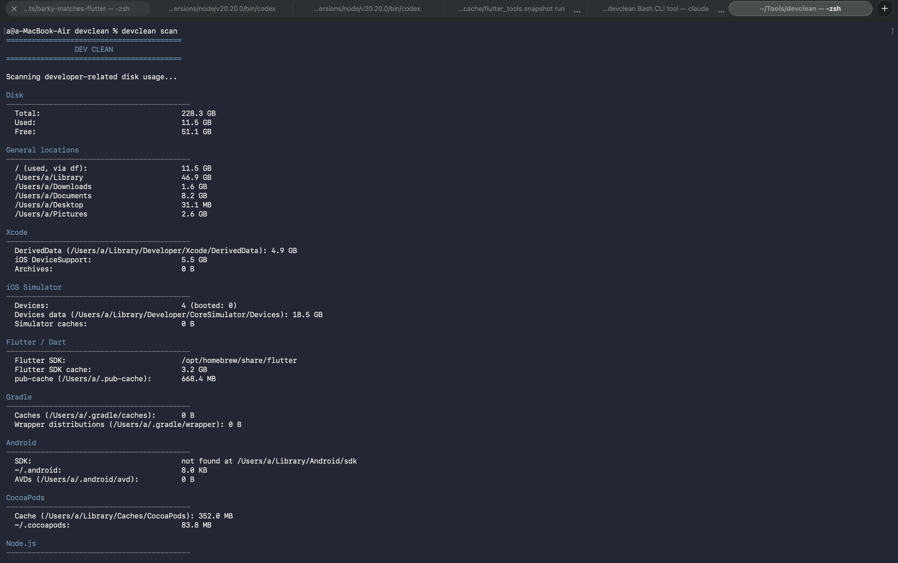
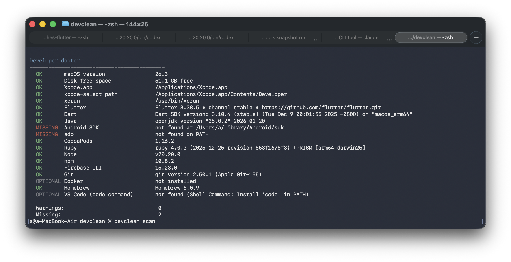

# devclean

> Safe macOS cleanup for Flutter, iOS, Android and Node.js developers.

---

# Installation

## Clone the repository

```bash
git clone https://github.com/shahlajahan/devclean.git
cd devclean
```

## Install

```bash
./install.sh
```

## Verify

```bash
devclean --version
```

Expected output:

```
devclean version 1.1.0
```

## Run

```bash
devclean scan
```

## Quick Clean Preview


> Safe macOS cleanup for Flutter, iOS, Android and Node.js developers.

`devclean` is a professional command-line tool that audits developer-related
disk usage on macOS and safely removes recreatable caches with explicit
confirmation.

Unlike generic cleanup tools, **devclean understands developer environments**
including Xcode, iOS Simulators, Flutter, Gradle, CocoaPods, Node.js,
Homebrew and Docker.

---

## ✨ Features

## Scan

devclean scans your complete development environment and estimates reclaimable storage.



- Audit developer disk usage
-  Diagnose development environment (`doctor`) with a 0-100 health score
-  Safe cache cleanup, one category at a time or multi-select
-  Global `--dry-run` mode
-  TXT, JSON & Markdown reports
-  Xcode cleanup
-  iOS Simulator cleanup
-  Flutter & Dart cleanup
-  Android & Gradle cleanup
-  Node / npm / yarn / pnpm / Bun cleanup
-  Homebrew cleanup
-  Docker cleanup
-  WhatsApp storage audit (read-only)
-  Check for updates (`devclean update`, never auto-updates)

---

## Why devclean?

A macOS developer machine slowly fills with:

- Xcode DerivedData
- Simulator devices
- iOS DeviceSupport
- Gradle caches
- CocoaPods caches
- Flutter pub-cache
- npm/yarn caches
- Docker images
- Homebrew downloads

Finding these manually is tedious.

**devclean scans them all in one place** and shows exactly what is safe to
remove before anything happens.

---

# Safety First

Safety is the primary design goal.

devclean **never deletes anything automatically.**

Every cleanup operation is explained before execution and always requires
confirmation.

There are two confirmation levels:

| Operation | Confirmation |
|-----------|--------------|
| Safe caches | `y/N` |
| High-impact operations | Type `DELETE` |

Examples of high-impact operations:

- Simulator deletion
- DeviceSupport removal
- Docker prune
- Archive removal
- Project build folders

---

## Dry Run

Every cleanup command supports dry-run.

```bash
devclean --dry-run clean
```

Instead of deleting anything it prints:

```
[DRY-RUN] remove DerivedData
[DRY-RUN] npm cache clean
...
```

This allows you to verify exactly what will happen.

---

# Installation

Clone the repository:

```bash
git clone https://github.com/YOUR_USERNAME/devclean.git
cd devclean
```

Install:

```bash
./install.sh
```

Run:

```bash
devclean
```

---

# Commands

| Command | Description |
|----------|-------------|
| `devclean` | Interactive menu |
| `devclean scan` | Disk usage audit |
| `devclean clean` | Cleanup menu (includes multi-select) |
| `devclean doctor` | Environment diagnostics + health score |
| `devclean report` | TXT + JSON + Markdown reports |
| `devclean update` | Check GitHub for a newer release (read-only) |
| `devclean --dry-run` | Preview without deleting |


## Developer Doctor

Check your development environment in seconds.



---

# What Can Be Cleaned?

| Component | Supported |
|------------|-----------|
| Xcode DerivedData | ✅ |
| DeviceSupport | ✅ |
| Simulators | ✅ |
| Flutter pub-cache | ✅ |
| Gradle cache | ✅ |
| CocoaPods cache | ✅ |
| npm / yarn / pnpm cache | ✅ |
| Bun cache | ✅ |
| Homebrew cache | ✅ |
| Docker | ✅ |

---

# What Will Never Be Removed

devclean intentionally refuses to touch:

- Source code
- Git repositories
- Credentials
- SSH keys
- Firebase configuration
- Provisioning profiles
- Signing certificates
- Databases
- `.env` files
- Anything outside your home directory
- WhatsApp messages or media

---

# WhatsApp

## WhatsApp Audit

Storage is analyzed safely without deleting anything.


devclean only audits WhatsApp storage.

It can:

- measure storage usage
- show Message / Media / Logs sizes
- open the folder in Finder

It **never deletes WhatsApp data.**

---

# Reports

Generate machine-readable reports:

```bash
devclean report
```

Outputs:

```
reports/
    devclean-report-20260711-221057.txt
    devclean-report-20260711-221057.json
    devclean-report-20260711-221057.md
```

The Markdown report is GitHub-friendly (renders directly if you commit it
or paste it into an issue/PR) and covers Disk, Developer Tools, Caches,
Estimated Reclaimable, and Recommendations.

---

# Testing

Run the test suite:

```bash
bash tests/test_utils.sh
bash tests/smoke_test.sh
```

---

# Requirements

- macOS
- Bash
- Xcode (optional)
- Flutter (optional)
- Android SDK (optional)
- Homebrew (recommended)

---

# Roadmap

## v1.1.0 (released)

- Multi-select cleanup (choose several categories, run them in sequence)
- Markdown reports alongside TXT/JSON
- ASCII progress indicator during `scan`
- Bun detection, scan, doctor, and cache cleanup
- pnpm version detection
- Doctor health score (0-100) and OK/WARNING/ERROR/OPTIONAL tiers
- `devclean update` - checks the latest GitHub Release (never auto-updates)

## Future ideas

- Disk usage history
- Faster scanning
- Brew package analysis
- Export HTML reports
- Plugin architecture
- CI support

Note: devclean will not add an *automatic* updater - manual, explicit
updates are part of the safety philosophy, not a temporary gap.

---

# Contributing

Contributions, bug reports and feature requests are welcome.

Please open an issue before submitting major changes.

---

# License

MIT License